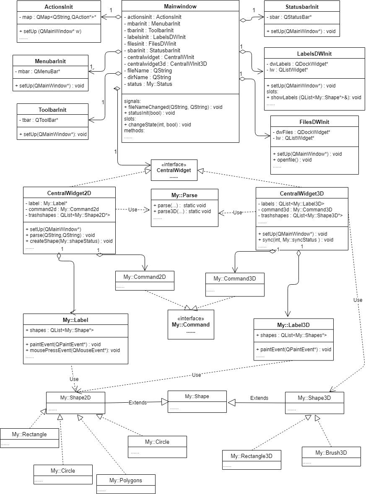

### LabelMe

#### For Developers

- 详细开发者文档请见[此处](html/index.html)
- 代码模块结构图：

#### For Users

- 程序运行流程：

  直接点击bin目录下的LabelMe.exe，即可开始运行程序，程序主界面：

程序界面主要分为六个区域，最上面为菜单栏，最左边为工具栏，中间为中心窗口（展示图片以及进行标注），右侧上方为展示标注标签的窗口，右侧下方为展示文件列表的窗口，最下面为状态栏。菜单栏、工具栏以及在中心窗口右键均可以选择命令进行执行，右侧的标签列表可以进行交互来进行与标注相关的动作，如切换、删除、编辑、隐藏标注等，右侧文件列表亦可进行交互来切换文件等。

- 程序功能说明：

  - 菜单栏功能部分：

    - Open : 打开图片文件，通过点击命令或者快捷键即可运行。打开文件后，右侧文件列表会显示在同一目录下的所有文件，点击文件列表中的文件即可进行切换。图片格式支持jpg、png、gif、bmp、jpeg等
  - Next Image：切换至下一张图片，若无下一张图片，会弹出窗口提醒用户，通过点击命令或者快捷键即可运行。3d状态下会切换当前聚焦视角的图片，可通过鼠标点击切换聚焦视角。
    - Prev Image ： 切换至上一张图片，若无上一张图片，会弹出窗口提醒用户，通过点击命令或者快捷键即可运行。3d状态下会切换当前聚焦视角的图片，可通过鼠标点击切换聚焦视角。
    - Open Dir：打开文件夹，通过点击或者快捷键即可运行。打开文件夹默认会显示文件夹中的第一张图片，同时右侧文件列表也会显示文件夹里的所有图片，点击文件列表中的文件可以进行文件切换。
    - Import：导入标注文件，通过点击即可运行。标注文件的样例文件请参考[此处](../examples/1.json)。
    - Save : 保存文件，通过点击或者快捷键即可运行。会将对标注的更改进行保存，写入默认标注文件中。
    - Close : 关闭当前文件，通过点击或者快捷键即可运行。
    - Quit : 退出程序，通过点击或者快捷键即可运行
    - Create Brush ：
      - 2d状态下：创建画刷形状，通过点击或者快捷键即可运行。创建画刷形状用于进行分割标注，在想要进行标注的区域，点击鼠标即可进行绘制，绘制完毕后按下回车键即可键入标注文字，添加标注。
      - 3d状态下：创建画刷形状，在任意视角任意图片直接点击鼠标进行绘制即可，绘制完毕后按下回车键，键入标注文字即可添加标注。
    - Edit Brush ：编辑画刷大小，通过点击或者快捷键即可运行。默认为圆形画刷，可以改变画刷大小（注，画刷大小是以当前图片的宽度为比例）
    - Create Rectangle ：
      - 2d状态下：创建矩形，通过点击或者快捷键即可运行。在想要进行标注的区域，点击鼠标开始绘制，在移动鼠标的过程中，会同步显示矩形边框，绘制完毕时，再点击鼠标即可。
      - 3d状态下：创建长方体，通过在任意视角的图片点击即可开始该视角下的矩形框的绘制，再次点击鼠标该视角下矩形框即绘制完毕，这时在其他视角，可以通过右键聚焦视角，并进行图片的切换，当其他视角下有最开始创建的矩形框时，移动鼠标即可进行其他视角下的矩形框的绘制，绘制完毕时再次点击鼠标即可，长方体绘制完毕后，按下回车键，键入标注文字，即可添加标注。
    - Create Circle：创建圆形，操作与创建矩形类似，请参考创建矩形。
    - Create Polygons：创建多边形，通过点击或者快捷键即可运行。在想要标注的区域，点击鼠标开始绘制，在想要绘制的多边形顶点处再次点击鼠标，继续绘制，绘制完毕后，按下回车键。（即文档中要求的绘制闭合折线）
    - Create Curve：创建平滑曲线，通过点击或者快捷键即可运行。在想要标注的区域，点击鼠标开始绘制，接着自由移动鼠标即可，绘制完毕后按下回车键。
    - Edit Color：编辑标注颜色，通过点击或者快捷键即可运行。会弹出颜色对话框，任意选颜色即可。
    - Edit Polygons：进入编辑状态，通过点击或者快捷键即可运行。点击后会进入编辑状态，在该状态下，可以对标注进行拖动，选中，撤销，重做，放大缩小等一系列操作。
    - Delete Polygons：删除标注，通过点击或者快捷键即可运行。该动作只有在编辑状态下且有标注被选中才能进行操作。
    - Edit Label：编辑标注文字，通过点击或者快捷键即可运行。该动作只有在编辑状态且有标注被选中才能进行操作。
    - Undo：撤销动作，通过点击或者快捷键即可运行。可以撤销任意步数的动作。
    - Redo：重做动作，通过点击或者快捷键即可运行。可以重做任意步数的动作。
    - Undo last point：撤销当前正在创建的标注形状，通过点击或者快捷键即可运行。会移除当前正在创建的标注形状。
    - Polygon Labels：是否显示标签列表组件，点击即可进行切换。
    - File List：是否显示文件列表，点击即可进行切换。
    - 3D：是否进入3D模式，点击即可进行2d及3d状态的转换。
    - Hide Polygons：隐藏所有标注，点击即可运行。
    - Show Polygons：显示所有标注，点击即可运行。
    - Magnifier：是否显示放大镜，点击即可运行。默认会捕捉鼠标附近20$\times$20的区域，放大至100$\times$100，显示在图片右下角（需注意图片的大小，因为会在图片右下角显示100$\times$100）
    - Zoom In：放大图片，点击或者快捷键即可运行。默认会放大图片至1.2倍。
    - Zoom Out：缩小图片，点击或者快捷键即可运行。默认会缩小图片至0.8倍。
    - Original Size：图片恢复至原始图片大小，点击或者快捷键即可运行。会使图片按照原始大小显示。
    - Fit Window：图片宽度适应中心窗口，点击或者快捷键即可运行。会使图片按照中心窗口宽度显示。
  
  - 工具栏功能部分：

    - 工具栏命令即为菜单栏命令的部分，请参考菜单栏命令

  - 状态栏功能部分：

    - 部分命令执行时会在状态栏处显示。
  - 鼠标在图片上移动时，会同步在状态栏处显示当前鼠标的坐标。2d显示二维坐标，3d显示三维坐标。
  
  - 中心窗口功能部分：

    - 为方便用户交互，图片上的标注形状默认显示为不填充，即只显示边框，当鼠标进入标注形状内部时，标注形状为悬浮（hovered）状态，内部会填充颜色，当鼠标点击标注形状时，标注形状为选中（selected）状态，内部也会填充颜色，同时在标签列表窗口处也会显示标签选中状态。当标注脱离悬浮状态（unhovered）或者未选中状态（unselected）时，内部会显示不填充。对选中的标注形状即可进行一系列操作，如拖动标注形状，删除，更改等动作。

    - 2d状态下，在中心窗口点击右键亦可选择执行部分命令，方便交互。
  - 3d状态下，中心窗口分为3个视角，三个视角顺序未从左至右，从上至下，分别为0，1，2。第一个视角为从上往下看的俯视视角，图片顺序为从上至下，第二个视角为正视视角，图片顺序为从后往前，第三个视角为右视视角，图片顺序为从左至右。鼠标点击视角可进行视角图片的聚焦，即切换视角。
  
  - 标签列表组件功能部分：

    - 在标签列表窗口中右键可以选择并执行部分命令
  - 在标签列表窗口中可以通过点击标签进行标注的选中，选中状态会同步至中心窗口中并显示标注形状填充
    - 改变标签列表窗口中标签的checkstate可以进行是否显示该标注状态的切换，checked为显示，unchecked为隐藏
    - 在中心窗口对标注的交互会在标签列表中同步更新，例如添加标注、删除标注等
  
  - 文件列表组件功能部分：

    - 2d状态下，在文件列表窗口中点击文件即可进行文件的切换
  - 3d状态下，由于文件的切换由中心窗口控制，因此点击不会有反应
  
  - 其他说明：

    - 标注文件默认名说明：在读取图片时，会读取默认标注文件，默认标注文件名与图片名相同，后缀名为json。3d状态下默认标注文件名为该文件夹下第一张图片名+“_3D”，后缀名为json。
  - 标注文件格式说明：type表明标注形状的类型，分为Brush（画刷形状），Rectangle（矩形形状），Polygons（多边形形状），Circle（圆形形状），Curve（平滑曲线形状），Brush3D（3d画刷形状），Rectangle3D（3d长方体形状）；color代表标注形状颜色；label代表标注标签文字，points代表像素点位（2d存储为横纵坐标比例，3d存储为横纵坐标比例，及z方向上的顺序）‘radius代表画刷形状的大小或者圆形形状的大小；width代表矩形的宽；height代表矩形的高；zspan代表3d长方体在z方向上的跨度
    - 关于大作业文档要求中的状态栏中显示标签名称和颜色，程序中使用标签列表窗口显示标签，且在点击标签时，中心窗口会同步标注形状被选中，内部会显示为填充，其中颜色也为由用户自定义。
    - examples文件夹里面有样例图片以及样例标注文件可做测试用。

#### Others

- 程序中额外调用opencv库，用于3d图片的处理及一些标注形状的处理；若需编译，请配置OPENCV_SDK_DIR（opencv库的环境变量）。